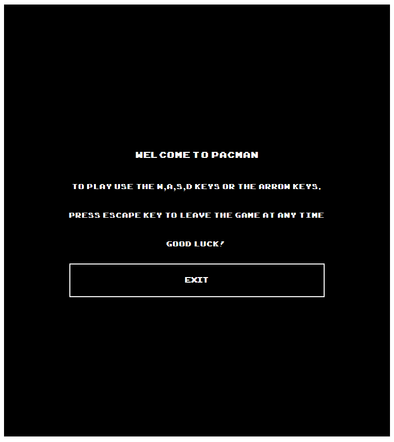
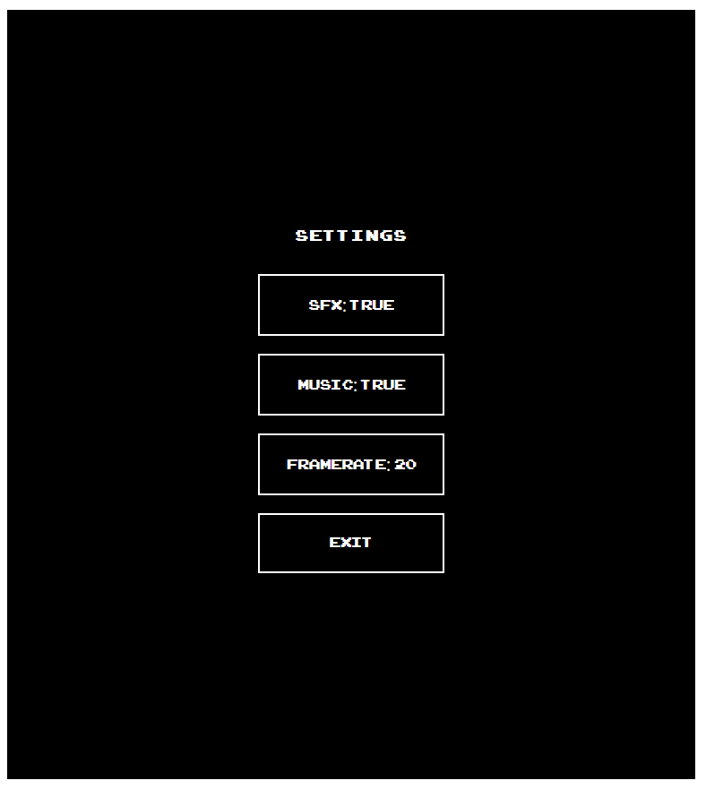

# PACMAN

# Summary

A [clone](https://aliwebs.github.io/project-1/) of the CLASSIC PACMAN game.

# Brief requirements

- Render the game in a browser
- Design logic for winning and display an endgame screen showing the result
- Implement a projectile system which successfully removes elements on screen upon impact
- Write out logic for enemy movement
- Stick with KISS (Keep It Simple Stupid) and DRY (Don't Repeat Yourself) principles
- Use JavaScript for DOM manipulation
- Deploy your game online for others to access
- Use semantic markup for HTML and CSS (adhere to best practices)

# Table of Contents
- [PACMAN](#pacman)
- [Summary](#summary)
- [Brief requirements](#brief-requirements)
- [Table of Contents](#table-of-contents)
- [Technologies Used](#technologies-used)
  - [Approach](#approach)
    - [Game start](#game-start)
    - [Reset](#reset)
    - [PACMAN game loop](#pacman-game-loop)
    - [Ghost game loop](#ghost-game-loop)
    - [Level grid](#level-grid)
    - [Movement](#movement)
      - [Pacman Movement](#pacman-movement)
      - [Pacman direction](#pacman-direction)
      - [Ghost Movement](#ghost-movement)
      - [Ghost Direction](#ghost-direction)
    - [Special items](#special-items)
- [Screenshots](#screenshots)
- [Struggles and Bugs](#struggles-and-bugs)
- [Future improvements and final thoughts](#future-improvements-and-final-thoughts)

# Technologies Used

* HTML
* CSS
* JavaScript
* Git & Github

## Approach

### Game start

The playGame function is called when the user clicks play on the game menu. It sets the RUN SPEED for the loops, it also sets isPlaying to true,runs the reset and setup functions and finally hides the main menu and the result window and shows the game window. There is also a check to see if localStorage has a property called 'highScore' if it doesn't exist it creates it and sets it to 0, because the reset function that ran previously resets the score to 0.

```javascript

function playGame() {
  const RUNSPEED = (10000 / FRAMERATE)
  isPlaying = true
  if (!isPlaying) return
  reset()
  setup()
  elements.mainMenu.style.display = 'none'
  elements.resultWindow.style.display = 'none'
  elements.mainWindow.style.display = 'block'

  if (localStorage) {
    if (!localStorage.getItem('highScore')) {
      localStorage.setItem('highestScore', score)
    }
  }

```

### Reset

The reset function removes all tiles from map, sets score to 0, and creates an object that contains a method that can be used to CREATE ghosts. In hindsight this object should have gone outside the setup function and with all the other objects. Finally the function sets PACMAN back to his default position and sets pacmans speed to 0. Again this should ideally have been a method on the PACMAN method.

```javascript
function reset() {
  gridArray.forEach((elt) => {
    elt.remove();
  });
  score = 0;
  activeGhosts = {
    add(ghostName) {
      if (this[ghostName] === undefined) {
        this[ghostName] = ghost(
          GHOSTS_PRESET[ghostName].x,
          GHOSTS_PRESET[ghostName].y,
          ghostName
        );
        return this[ghostName];
      }
    },
  };
  pacman.x = 13;
  pacman.y = 23;
  pacman.speed.x = 0;
  pacman.speed.y = 0;
}
```

### PACMAN game loop

This interval just checks if PACMAN steps in portals and teleports accordingly, also it calls the move method to make PACMAN move in the current direction and calls the eatFood method to make PACMAN eat food.

```javascript
setInterval(() => {
  //? Teleport pacman
  if (
    pacman.current().classList.contains("portalLeft") ||
    pacman.current().classList.contains("portalRight")
  ) {
    pacman.teleport();
    return;
  }

  pacman.move();
  //! pacman stops moving if it hits a wall while moving in a
  //! given direction until player turns pacman
  //start pac man move and eatFood methods
  pacman.eatFood();
}, RUNSPEED - 200);
```

### Ghost game loop

The ghost set interval calls the ghost move method every frame.

```javascript
setInterval(() => {
  activeGhosts.inky.move(changeDirection);
  activeGhosts.pinky.move(changeDirection);
  activeGhosts.clyde.move(changeDirection);
  activeGhosts.blinky.move(changeDirection);
}, RUNSPEED + 100);
```


### Level grid

The approach I had when making the level grid was to have coordinates for each tile in the grid indicating the type of grid it was going to be. I was thinking of the possibility of having a map builder later on. Although I did not have time to implement the user interface for such a feature I do have the code for it (commented out) inside the main JS file. The setup function below creates a map with the specified width and height and it maps the preset onto the map, the preset has to be made for the map of the specified size otherwise the preset does not draw properly. The setup function also smoothens the walls by removing all the borders from wall tiles that are facing other wall tiles.

```javascript

function setup() {
  // refer to ./functions.js file
  mappedGridArray = createMap(HEIGHT, WIDTH)
  //? add blueprint onto grid, for MVP it will be a static board
  // from the map1 array gives the class wall to all walls
  map1.forEach((coordinate) => {
    mappedGridArray[coordinate[0]][coordinate[1]].classList.add('wall')
    mappedGridArray[coordinate[0]][coordinate[1]].type = 'wall'
  })
  // gives the class empty to all other boxes outside player path that are not walls
  map1Exclude.forEach((coordinate) => {
    mappedGridArray[coordinate[0]][coordinate[1]].classList.add('empty')
    mappedGridArray[coordinate[0]][coordinate[1]].type = 'empty'
  })

  //removes all edges that are facing another wall
  for (let i = 0; i < gridArray.length; i++) {
    if (gridArray[i].classList.contains('wall')) {
      if (gridArray[i + 1] !== undefined
        && gridArray[i + 1].classList.contains('wall')) {
        gridArray[i].style.borderRight = 'none'
      }
      if (gridArray[i - 1] !== undefined
        && gridArray[i - 1].classList.contains('wall')) {
        gridArray[i].style.borderLeft = 'none'
      }
      if (gridArray[i - WIDTH] !== undefined
        && gridArray[i - WIDTH].classList.contains('wall')) {
        gridArray[i].style.borderTop = 'none'
      }
      if (gridArray[i + WIDTH] !== undefined
        && gridArray[i + WIDTH].classList.contains('wall')) {
        gridArray[i].style.borderBottom = 'none'
      }
    }
  }

```

### Movement

#### Pacman Movement

Pacman's movement relies on a method in the pacman object that moves pacman depending on his x and y speed, every time the setInterval runs this method is called

```javascript
move() {
  if (this.target() === undefined) return
  if (!this.target().classList.contains('wall')) {
    this.remove()
    this.x += (this.speed.x)
    this.y += (this.speed.y)
    this.spawn()
  }
```

#### Pacman direction

User input changes the direction of movement and does not control the speed of pacman, I thought this was a better experience for an arcade game, the snippet below is the logic that controls direction with user input

```javascript
if (key === "w" || key === "ArrowUp") {
  if (!up.classList.contains("wall") && pacman.speed.y !== -1) {
    pacman.speed.x = 0;
    pacman.speed.y = -1;
    document.documentElement.style.setProperty("--rotateVal", "-90deg");
  }
} else if (key === "s" || key === "ArrowDown") {
  if (!down.classList.contains("wall") && pacman.speed.y !== 1) {
    pacman.speed.x = 0;
    pacman.speed.y = 1;
    document.documentElement.style.setProperty("--rotateVal", "90deg");
  }
} else if (key === "a" || key === "ArrowLeft") {
  if (!left.classList.contains("wall") && pacman.speed.x !== -1) {
    pacman.speed.y = 0;
    pacman.speed.x = -1;
    document.documentElement.style.setProperty("--rotateVal", "180deg");
  }
} else if (key === "d" || key === "ArrowRight") {
  if (!right.classList.contains("wall") && pacman.speed.x !== 1) {
    pacman.speed.y = 0;
    pacman.speed.x = 1;
    document.documentElement.style.setProperty("--rotateVal", "360deg");
  }
}
```

#### Ghost Movement

Ghosts move similarly using the method below on the ghost object to PACMAN except they are in their own loop and have their own speed, for level one that is slower than pacman. The move function takes in a function which decides and changes the heading direction of the ghost then the move function moves the ghost in that direction accordingly. If PACMAN's energizer status (bigFood) is active it will also change the ghost status to blinking

```javascript
move(movementLogic) {
      if (typeof movementLogic === 'function') {
        movementLogic(this)
        if (mappedGridArray[this.y][this.x].querySelector('.ghost') !== null) {
          //remove the ghost from current position
          this.remove()
          //moves ghost in that direction
          this.x += (this.speed.x)
          this.y += (this.speed.y)
          //add ghost on new position
          this.spawn()
        }
      } else if (movementLogic !== undefined) {
        this.remove()
        this.x = movementLogic.pos.x
        this.y = movementLogic.pos.y
        this.spawn()
      }
      if (pacman.bigFood) {
        const array = Object.entries(activeGhosts)
        for (let i = 1; i < array.length; i++) {
          array[i][1].blinking()
        }
      } else {
        this.stopBlinking()
      }
      //add position to visited
      this.visited.push(`${this.y}:${this.x}`)
    }
```

#### Ghost Direction

Ghosts direction changes with the following 3 functions, availableDirections checks which direction the ghost is going and gives it the opposite direction i.e. (going horizontal will switch to vertical). The second function change direction first checks if the current tile is a part if that is the case it will teleport the ghost, otherwise it will check if the next tile is a 'path' in which case it will pick one direction to move the ghosts to. If the target tile is a wall it will reverse the direction of movement. The checkDirection is the function that finalizes and changes the direction of the ghost, after checking if the path where it is trying to go is a path.

```javascript
function checkDirection(availableDirections, ghost) {
  const cellUp = mappedGridArray[ghost.y - 1][ghost.x];
  const cellDown = mappedGridArray[ghost.y + 1][ghost.x];
  const cellLeft = mappedGridArray[ghost.y][ghost.x - 1];
  const cellRight = mappedGridArray[ghost.y][ghost.x + 1];
  //check if there is a path up
  if (
    cellUp.type === "path" &&
    availableDirections.includes("up") &&
    cellUp.querySelector(".ghost") === null
  ) {
    ghost.speed.x = 0;
    ghost.speed.y = -1;
    //check if there is a path on the right and then move to the right
    //if a wall is found then call this function again
  } else if (
    cellRight.type === "path" &&
    availableDirections.includes("right") &&
    cellRight.querySelector(".ghost") === null
  ) {
    ghost.speed.y = 0;
    ghost.speed.x = 1;
    //check if there is a path down
  } else if (
    cellDown.type === "path" &&
    availableDirections.includes("down") &&
    cellDown.querySelector(".ghost") === null
  ) {
    ghost.speed.x = 0;
    ghost.speed.y = 1;
    //check if there is a path on the left
  } else if (
    cellLeft.type === "path" &&
    availableDirections.includes("left") &&
    cellLeft.querySelector(".ghost") === null
  ) {
    ghost.speed.y = 0;
    ghost.speed.x = -1;
  }
}
//check if there all available directions
function availableDirections(ghost) {
  if (ghost.speed.x === -1 || ghost.speed.x === 1) {
    return ["up", "down"];
  }
  if (ghost.speed.y === -1 || ghost.speed.y === 1) {
    return ["right", "left"];
  }
  return ["up", "down", "left", "right"];
}

function changeDirection(ghost) {
  // check if the path ahead is not a wall or a tunnel
  if (
    ghost.current().classList.contains("portalLeft") ||
    ghost.current().classList.contains("portalRight")
  ) {
    ghost.teleport();
    return;
  }
  if (ghost.target().classList.contains("path")) {
    //for each block that the ghost is at give me all available directions
    //if the available direction is more than one pick randomly between the two
    //change direction
    const difAvailableDirections = availableDirections(ghost);
    const randomChoice = Math.floor(
      Math.random() * difAvailableDirections.length
    );
    checkDirection([difAvailableDirections[randomChoice]], ghost);
  } else if (ghost.target().type === "wall") {
    checkDirection(availableDirections(ghost), ghost);
  }
}
```

### Special items

Special items get placed onto the map on fixed tiles that are hardcoded, if the map builder feature was finished this would be a function that would accept parameters for the locations of the special items. The code below places food on all paths, then it places energizers, portals and finishes by cleaning up food from areas not accessible to PACMAN.

```javascript
//? place the food that pacman needs to collect
//place food on all free path cells
mappedGridArray.forEach((row) => {
  row.forEach((cell) => {
    if (!cell.classList.contains("wall") && cell.classList[0] !== "empty") {
      const span = document.createElement("span");
      span.classList.add("food");
      cell.appendChild(span);
      cell.type = "path";
      cell.classList.add("path");
    }
  });
});
//place energizer
const bigFoodCord = [
  [5, 2],
  [5, 24],
  [22, 2],
  [22, 24],
];

bigFoodCord.forEach((bigFood) => {
  const elt = mappedGridArray[bigFood[0]][bigFood[1]].querySelector(".food");
  elt.classList.remove("food");
  elt.classList.add("bigFood");
});

//? set up teleport tunnels
mappedGridArray[14][1].classList.add("portalLeft");
mappedGridArray[14][25].classList.add("portalRight");
//?take food away from holding pen
mappedGridArray[13][13].children[0].classList.remove("food");
mappedGridArray[14][12].children[0].classList.remove("food");
mappedGridArray[15][12].children[0].classList.remove("food");
mappedGridArray[14][13].children[0].classList.remove("food");
mappedGridArray[15][13].children[0].classList.remove("food");
mappedGridArray[14][14].children[0].classList.remove("food");
mappedGridArray[15][14].children[0].classList.remove("food");
mappedGridArray[23][13].children[0].classList.remove("food");
```

# Screenshots

Game Menu


Instructions


Settings


Game Window


# Struggles and Bugs

I guess the biggest struggle I had was at the start of the project where I had to figure out how to convert an array of coordinates into an actual map. Another struggle I had was that the ghosts' movements would at times stop so I had to make an unlogical move with some of the else statements in the direction decision function.

There was a big win due to that blocker though, which is that I was able to make my game work on an X and Y axis basis where implementing movement became much easier.

The biggest bug so far in the game is that sometimes ghosts get stuck in walls, pass through the player etc. I added a lot of steps checking if the tile the ghost is moving to is a path or a wall but this bug still persists and unfortunately could not be solved. I do have an idea now of what it might have been, more likely than not it is to do with the timing between the two different setIntervals that run PACMAN and the GHOSTS independently. 

# Future improvements and final thoughts

The game can be improved by having more levels. Another thing that I really wanted to implement but didn't get time to implement was the map builder.

Overall the project was fun to make and the game is fun to play although there is only one level you can try changing the FPS to make the game harder to play. Have fun!

